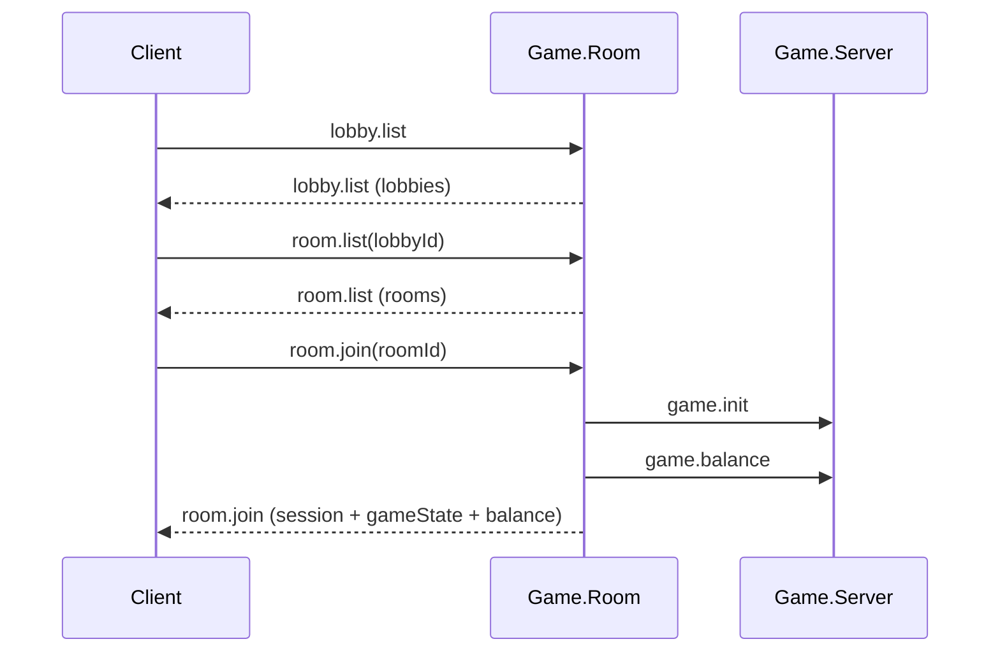

# Phoenix Crash WebSocket 流程與接口整理

## 1. 進房主流程

1. `lobby.list`
2. `room.list`
3. `room.join`



---

## 2. 基本訊息格式

### Client -> Server

```json
{
  "op": "<opcode>",
  "data": {}
}
```

### Server -> Client (成功)

```json
{
  "status": "ok",
  "type": "<opcode or event>",
  "data": {}
}
```

### Server -> Client (錯誤)

```json
{
  "status": "error",
  "code": "<error_code>",
  "message": "<error_message>"
}
```

---

## 3. 主要接口

## 3.1 `lobby.list`

用途：先拿可用大廳。

Request:

```json
{
  "op": "lobby.list",
  "data": {
    "gameCode": "phoenix"
  }
}
```

Response (範例):

```json
{
  "status": "ok",
  "type": "lobby.list",
  "data": {
    "lobbies": [
      {
        "lobbyId": "lobby-1",
        "name": "Phoenix Lobby",
        "gameCode": "phoenix",
        "currencyCode": "TWD",
        "minBet": 20,
        "maxBet": 20000,
        "status": "active"
      }
    ]
  }
}
```

重點欄位：`lobbyId`, `gameCode`, `currencyCode`, `minBet`, `maxBet`, `status`。

---

## 3.2 `room.list`

用途：用 `lobbyId` 取得房間清單。

Request:

```json
{
  "op": "room.list",
  "data": {
    "lobbyId": "lobby-1",
    "status": "open",
    "limit": 50
  }
}
```

`status` 與 `limit` 可省略。
`limit` 實際會被後端夾在 `1~200`，預設 `50`。

Response (範例):

```json
{
  "status": "ok",
  "type": "room.list",
  "data": {
    "rooms": [
      {
        "roomId": "phoenix-room-002",
        "gameType": "Crash",
        "gameCode": "phoenix",
        "playersCount": 3,
        "maxPlayers": 100,
        "status": "open"
      }
    ]
  }
}
```

重點欄位：`roomId`, `playersCount`, `maxPlayers`, `status`。

---

## 3.3 `room.join`

用途：進入房間，並帶回初始化資料。

Request:

```json
{
  "op": "room.join",
  "data": {
    "roomId": "phoenix-room-002"
  }
}
```

Response (範例):

```json
{
  "status": "ok",
  "type": "room.join",
  "data": {
    "roomId": "phoenix-room-002",
    "gameCode": "phoenix",
    "playerId": "player_001",
    "sessionId": "<session-id>",
    "minBet": 20,
    "maxBet": 20000,
    "gameState": {
      "currencyCode": "TWD",
      "minBet": 20,
      "maxBet": 20000,
      "betOptions": [1000, 2000, 3000]
    },
    "balance": {
      "playerId": "player_001",
      "currency": "TWD",
      "balanceUnits": "100000.00"
    },
    "roundHistory": {
      "items": []
    }
  }
}
```

重點欄位：`sessionId`, `gameState`, `balance.balanceUnits`。

---

## 4. 常用後續接口

## 4.1 `game.init`

用途：重拉初始化資料（例如重連後）。

Request:

```json
{
  "op": "game.init",
  "data": {
    "roomId": "phoenix-room-002"
  }
}
```

Response (重點範例):

```json
{
  "status": "ok",
  "type": "game.init",
  "data": {
    "roomId": "phoenix-room-002",
    "gameCode": "phoenix",
    "sessionId": "<session-id>",
    "minBet": 20,
    "maxBet": 20000,
    "gameState": {
      "currencyCode": "TWD",
      "minBet": 20,
      "maxBet": 20000,
      "startMultiplier": 0.1,
      "maxMultiplier": 10,
      "tickIntervalMs": 50,
      "multiplierCurve": [
        { "t": 0.0, "m": 0.2 },
        { "t": 0.4, "m": 0.4 },
        { "t": 0.8, "m": 0.65 },
        { "t": 1.3, "m": 0.85 },
        { "t": 1.8, "m": 0.95 },
        { "t": 2.5, "m": 1.2 }
      ],
      "existingBets": [
        {
          "betId": "round-xxx:player_001:1",
          "betAmount": 1000,
          "autoCashoutMultiplier": 1.5,
          "betIndex": 0,
          "status": "Pending",
          "cashoutMultiplier": null,
          "payoutNet": null,
          "currentProfit": 1260.0
        },
        {
          "betId": "round-xxx:player_001:2",
          "betAmount": 1000,
          "autoCashoutMultiplier": 1.5,
          "betIndex": 1,
          "status": "CashedOut",
          "cashoutMultiplier": 1.5,
          "payoutNet": 1425.0,
          "currentProfit": 1500.0
        }
      ],
      "totalProfit": 2760.0
    }
  }
}
```

更新重點：
- `gameState.multiplierCurve` 目前為「曲線表陣列」，來源是 `CrashMath.CurveTable`。
- 不再使用字串型態（例如 `"linear"`）表示曲線。
- `gameState.existingBets` 會回傳該玩家當前回合已存在的下注資料（每注一筆）。
- `gameState.totalProfit` 為 Running 狀態下該玩家目前各注 `currentProfit` 的總和；非 Running 可能為 `null`。
- `game.init` 在 `Game.Room` 有快取（Redis key: `gameinit:{roomId}:{playerId}`），改規格後若仍看到舊值需先清快取或重連觸發重取。

---

## 4.2 `game.balance`

用途：查玩家即時餘額。

Request:

```json
{
  "op": "game.balance",
  "data": {
    "roomId": "phoenix-room-002"
  }
}
```

Response (範例):

```json
{
  "status": "ok",
  "type": "game.balance",
  "data": {
    "playerId": "player_001",
    "currency": "TWD",
    "balanceUnits": "99850.00"
  }
}
```

---

## 4.3 `game.action` - `crash.bet`

用途：下注。

Request:

```json
{
  "op": "game.action",
  "data": {
    "roomId": "phoenix-room-002",
    "method": "crash.bet",
    "payload": {
      "betUnits": 1000,
      "autoCashoutMultiplier": 1.5,
      "betIndex": 0
    }
  }
}
```

---

## 4.4 `game.action` - `crash.cashout`

用途：手動 cashout。

Request:

```json
{
  "op": "game.action",
  "data": {
    "roomId": "phoenix-room-002",
    "method": "crash.cashout",
    "payload": {
      "betIndex": 0
    }
  }
}
```

---

## 5. 重要廣播

## 5.1 `room.round.state`

會依狀態帶不同欄位：
- `Betting`: `bettingCountdown`, `leaderboard`
- `Running`: `currentMultiplier`, `runningElapsed`, `leaderboard`
- `Crashed`: `crashPoint`, `crashedCountdown`, `runningElapsed`, `leaderboard`

目前規格重點：
- top-level 已不帶 `cashoutAmount`
- `Running` 狀態下 `leaderboard[].betStatuses` 為「純狀態陣列」

Running 範例：

```json
{
  "type": "room.round.state",
  "status": "ok",
  "data": {
    "roomId": "phoenix-room-002",
    "roundId": "<round-id>",
    "gameCode": "phoenix",
    "state": "Running",
    "currentMultiplier": 1.47,
    "runningElapsed": 2872,
    "leaderboard": [
      {
        "playerId": "player_001",
        "totalBet": 3000,
        "profit": 4410,
        "betStatuses": [1, 1, 0],
        "rank": 1
      }
    ]
  }
}
```

---

## 5.2 其他常見廣播

- `room.round.started`
- `room.bet.placed`
- `room.cashout.done`
- `room.round.ended`

---

## 6. 錯誤碼（常見）

- `missing_room_id`
- `missing_lobby_id`
- `room_not_found`
- `lobby_not_found`
- `room_full`
- `currency_mismatch`
- `not_joined_room`
- `invalid_json`
- `unknown_op`

---

## 7. 原始版補齊（本次補更新）

以下是原始文件常用但上一版精簡稿未完整列出的項目。

## 7.1 `room.leave`

用途：離開房間。

Request:

```json
{
  "op": "room.leave",
  "data": {
    "roomId": "phoenix-room-002"
  }
}
```

Response (範例):

```json
{
  "status": "ok",
  "type": "room.leave",
  "data": {
    "roomId": "phoenix-room-002",
    "shouldClose": false,
    "rooms": []
  }
}
```

---

## 7.2 `game.action` 其他常用 method

`game.action` 是通用入口，常用 `method` 包含：

- `crash.bet`
- `crash.cashout`
- `crash.state`
- `crash.bets`
- `crash.roundHistory`

共通 Request 格式：

```json
{
  "op": "game.action",
  "data": {
    "roomId": "phoenix-room-002",
    "method": "crash.state",
    "payload": {}
  }
}
```

---

## 7.3 `crash.state` / `crash.bets` / `crash.roundHistory` 用途

- `crash.state`: 查當前回合狀態（Betting/Running/Crashed 等）
- `crash.bets`: 查該玩家本回合下注明細
- `crash.roundHistory`: 查近期歷史回合

回傳都會包在：

```json
{
  "status": "ok",
  "type": "game.action",
  "data": {
    "method": "<method>",
    "payload": {}
  }
}
```

---

## 7.4 廣播欄位更新重點（你最近調整）

`room.round.state` 目前以最新實作為準：

- top-level 不再帶 `cashoutAmount`
- `Running` 時，`leaderboard[].betStatuses` 為狀態陣列，例如 `[1,1,0]`
- `Crashed` 時仍可看到完整 leaderboard（含每注狀態資訊）

---

## 7.5 進房後建議初始化順序

1. `lobby.list`
2. `room.list`
3. `room.join`
4. `game.init`（可選，重拉一次）
5. `game.balance`（建議主動拉餘額）
6. 訂閱並處理 `room.round.state`、`room.bet.placed`、`room.cashout.done`

